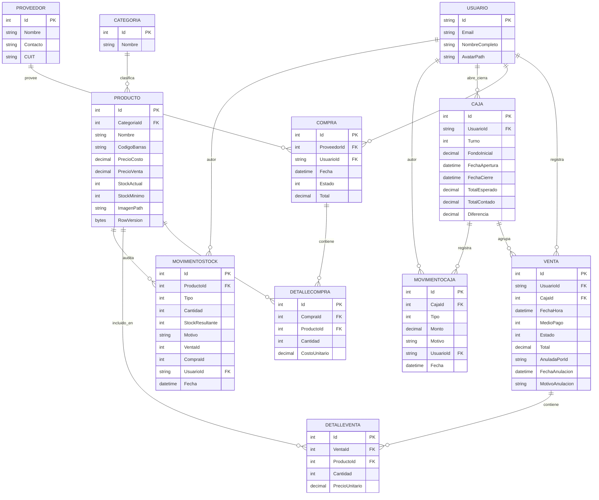

# Laboratorio-II-KioscoElRepo
Sistema POS para Kiosco 24hs

## Diagrama E-R

```mermaid
erDiagram
    CATEGORIA       ||--o{ PRODUCTO         : clasifica
    PROVEEDOR       ||--o{ COMPRA           : provee
    COMPRA          ||--o{ DETALLECOMPRA    : contiene
    PRODUCTO        ||--o{ DETALLECOMPRA    : incluido_en
    VENTA           ||--o{ DETALLEVENTA     : contiene
    PRODUCTO        ||--o{ DETALLEVENTA     : incluido_en
    USUARIO         ||--o{ VENTA            : registra
    USUARIO         ||--o{ COMPRA           : registra
    USUARIO         ||--o{ CAJA             : abre_cierra
    CAJA            ||--o{ VENTA            : agrupa
    CAJA            ||--o{ MOVIMIENTOCAJA   : registra
    USUARIO         ||--o{ MOVIMIENTOCAJA   : autor
    PRODUCTO        ||--o{ MOVIMIENTOSTOCK  : audita
    USUARIO         ||--o{ MOVIMIENTOSTOCK  : autor

    CATEGORIA {
        int     Id PK
        string  Nombre
    }
    PRODUCTO {
        int      Id PK
        int      CategoriaId FK
        string   Nombre
        string   CodigoBarras
        decimal  PrecioCosto
        decimal  PrecioVenta
        int      StockActual
        int      StockMinimo
        string   ImagenPath
        bytes    RowVersion
    }
    PROVEEDOR {
        int     Id PK
        string  Nombre
        string  Contacto
        string  CUIT
    }
    COMPRA {
        int      Id PK
        int      ProveedorId FK
        string   UsuarioId FK
        datetime Fecha
        int      Estado
        decimal  Total
    }
    DETALLECOMPRA {
        int      Id PK
        int      CompraId FK
        int      ProductoId FK
        int      Cantidad
        decimal  CostoUnitario
    }
    VENTA {
        int      Id PK
        string   UsuarioId FK
        int      CajaId FK
        datetime FechaHora
        int      MedioPago
        int      Estado
        decimal  Total
        string   AnuladaPorId
        datetime FechaAnulacion
        string   MotivoAnulacion
    }
    DETALLEVENTA {
        int      Id PK
        int      VentaId FK
        int      ProductoId FK
        int      Cantidad
        decimal  PrecioUnitario
    }
    CAJA {
        int      Id PK
        string   UsuarioId FK
        int      Turno
        decimal  FondoInicial
        datetime FechaApertura
        datetime FechaCierre
        decimal  TotalEsperado
        decimal  TotalContado
        decimal  Diferencia
    }
    MOVIMIENTOCAJA {
        int      Id PK
        int      CajaId FK
        int      Tipo
        decimal  Monto
        string   Motivo
        string   UsuarioId FK
        datetime Fecha
    }
    MOVIMIENTOSTOCK {
        int      Id PK
        int      ProductoId FK
        int      Tipo
        int      Cantidad
        int      StockResultante
        string   Motivo
        int      VentaId
        int      CompraId
        string   UsuarioId FK
        datetime Fecha
    }
    USUARIO {
        string  Id PK
        string  Email
        string  NombreCompleto
        string  AvatarPath
    }
```
