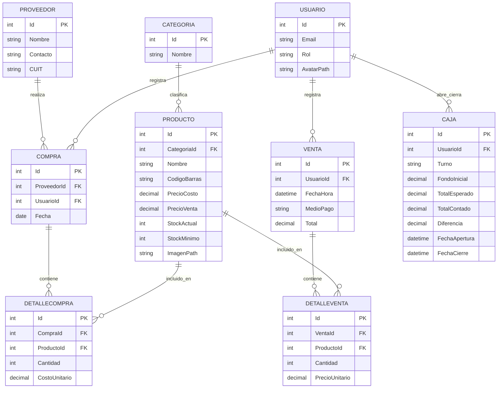

# Laboratorio-II---Final
Sistema POS para Kiosco 24hs

## Diagrama E-R

```mermaid
erDiagram
    CATEGORIA ||--o{ PRODUCTO : clasifica
    PROVEEDOR ||--o{ COMPRA : realiza
    COMPRA ||--o{ DETALLECOMPRA : contiene
    PRODUCTO ||--o{ DETALLECOMPRA : incluido_en
    VENTA ||--o{ DETALLEVENTA : contiene
    PRODUCTO ||--o{ DETALLEVENTA : incluido_en
    USUARIO ||--o{ VENTA : registra
    USUARIO ||--o{ COMPRA : registra
    USUARIO ||--o{ CAJA : abre_cierra

    CATEGORIA {
        int Id PK
        string Nombre
    }
    PRODUCTO {
        int Id PK
        int CategoriaId FK
        string Nombre
        string CodigoBarras
        decimal PrecioCosto
        decimal PrecioVenta
        int StockActual
        int StockMinimo
        string ImagenPath
    }
    PROVEEDOR {
        int Id PK
        string Nombre
        string Contacto
        string CUIT
    }
    COMPRA {
        int Id PK
        int ProveedorId FK
        int UsuarioId FK
        date Fecha
    }
    DETALLECOMPRA {
        int Id PK
        int CompraId FK
        int ProductoId FK
        int Cantidad
        decimal CostoUnitario
    }
    VENTA {
        int Id PK
        int UsuarioId FK
        datetime FechaHora
        string MedioPago
        decimal Total
    }
    DETALLEVENTA {
        int Id PK
        int VentaId FK
        int ProductoId FK
        int Cantidad
        decimal PrecioUnitario
    }
    CAJA {
        int Id PK
        int UsuarioId FK
        string Turno
        decimal FondoInicial
        decimal TotalEsperado
        decimal TotalContado
        decimal Diferencia
        datetime FechaApertura
        datetime FechaCierre
    }
    USUARIO {
        int Id PK
        string Email
        string Rol
        string AvatarPath
    }
```
